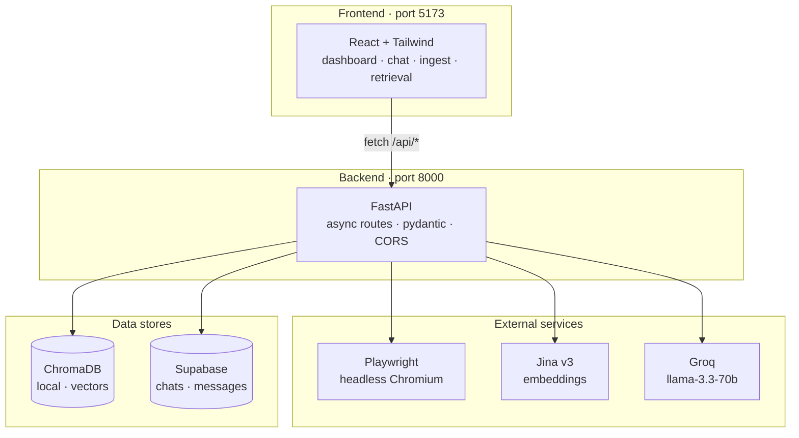
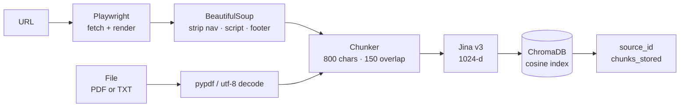
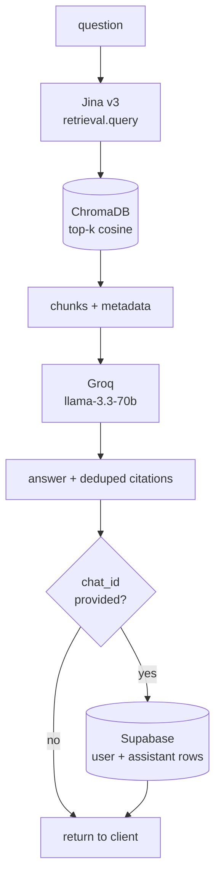
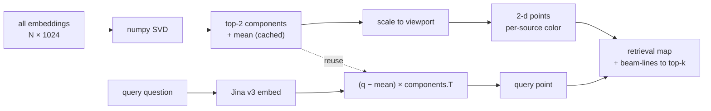

# Scrybe

It writes down what it reads, then answers what you ask.

A self-building knowledge base — feed it URLs and files, ask anything, get grounded answers with citations.

Full-stack: web automation, RAG pipeline, vector search, LLM orchestration, persisted chat.

---

## What it does

You point it at URLs or upload PDFs/TXT. It scrapes, chunks, embeds, and stores everything in a vector store. Then you ask questions through a chat UI and get answers grounded in your sources, with citations you can click through. Every chat is saved to Supabase so you can pick up old threads.

---

## Architecture



---

## Ingest workflow



## Query workflow



## Retrieval map

Every chunk in ChromaDB is projected from 1024-d Jina space to 2-d via numpy PCA, colored per source. Running a query embeds the question, projects it through the same PCA matrix, and overlays it with beam-lines to the top-k hits.



---

## Measured retrieval quality

Every number below comes from a committed artifact under [`evals/results/`](evals/results/).
Nothing here is estimated. Reproduce with:

```bash
python evals/run.py --config evals/configs/dense_baseline.json
python evals/compare.py evals/results/*.json
```

**Corpus:** 35 Wikipedia articles on Python and its ecosystem, pinned by revision id
(`corpus_sha256` `4a19de66…`). **Embeddings:** `jina-embeddings-v3`. **Reranker:**
`jina-reranker-v3`. **Index:** exact cosine, no ANN approximation. **Retrieval:** top-10,
scored at k=5.

### Two answer keys

There are two independent label sets, and they disagree enough to matter:

| | author | queries | how it was made |
| --- | --- | --- | --- |
| [`retrieval.json`](evals/labels/retrieval.json) | `claude-opus-5` | 32 answerable, 5 unanswerable | written by the same model that wrote the retriever |
| [`retrieval-independent.json`](evals/labels/retrieval-independent.json) | `abhi` | 26 answerable, 5 unanswerable | drafted by a different model, spans checked and fixed by hand |

The first set is not ground truth — the model that decided what counts as a correct
retrieval also built the thing being scored. It is kept because throwing away a
measurement because you dislike it is its own kind of dishonesty, and because the two sets
agree on *direction* even where they disagree on level. **The independent set is the one to
read.** Both tables are below.

#### Independent labels — 22 queries every configuration could score

| Config | recall@5 | doc recall@5 | nDCG@5 | MRR | chars@5 |
| --- | --- | --- | --- | --- | --- |
| fixed 800/150 · dense (production) | 0.545 | 0.818 | 0.488 | 0.505 | 3,910 |
| fixed 800/150 · hybrid (BM25 + RRF) | 0.523 | 0.773 | 0.469 | 0.490 | 3,910 |
| fixed 800/150 · dense + MMR (λ=0.5) | 0.341 | 0.750 | 0.356 | 0.417 | 3,949 |
| fixed 400/80 · dense | 0.568 | 0.727 | 0.450 | 0.433 | 1,995 |
| fixed 1600/300 · dense | 0.712 | 0.864 | 0.609 | 0.628 | 7,405 |
| sentence 800 · dense | 0.538 | 0.773 | 0.518 | 0.559 | 3,534 |
| fixed 800/150 · dense/20 + rerank | 0.682 | 0.818 | 0.617 | 0.643 | 3,958 |
| fixed 800/150 · dense/50 + rerank | 0.773 | 0.864 | 0.693 | 0.719 | 3,983 |
| fixed 800/150 · hybrid/50 + rerank | 0.818 | **0.909** | 0.735 | 0.742 | 3,974 |
| fixed 1600/300 · dense/50 + rerank | **0.848** | 0.886 | **0.761** | **0.769** | 7,673 |

#### Model-authored labels — 27 queries every configuration could score

| Config | recall@5 | doc recall@5 | nDCG@5 | MRR | chars@5 |
| --- | --- | --- | --- | --- | --- |
| fixed 800/150 · dense (production) | 0.806 | 0.898 | 0.702 | 0.699 | 3,905 |
| fixed 800/150 · hybrid (BM25 + RRF) | 0.806 | 0.935 | 0.688 | 0.683 | 3,928 |
| fixed 800/150 · dense + MMR (λ=0.5) | 0.657 | 0.917 | 0.608 | 0.640 | 3,959 |
| fixed 400/80 · dense | 0.722 | 0.870 | 0.643 | 0.668 | 1,986 |
| fixed 1600/300 · dense | 0.861 | 0.880 | 0.787 | 0.805 | 7,770 |
| sentence 800 · dense | 0.799 | 0.880 | 0.707 | 0.725 | 3,619 |
| fixed 800/150 · dense/20 + rerank | 0.880 | 0.926 | 0.833 | **0.864** | 3,908 |
| fixed 800/150 · dense/50 + rerank | 0.889 | 0.926 | 0.837 | 0.857 | 3,943 |
| fixed 800/150 · hybrid/50 + rerank | **0.907** | **0.944** | **0.852** | 0.858 | 3,930 |
| fixed 1600/300 · dense/50 + rerank | 0.889 | 0.907 | 0.848 | 0.865 | 7,698 |

`dense/50` means dense retrieval fetching 50 candidates and returning 10. `+ rerank` is a
cross-encoder over that pool.

### What the numbers say

**The independent labels cut production recall@5 from 0.806 to 0.545.** Document recall
barely moved (0.898 → 0.818). The retriever was finding the right article and returning the
wrong passage inside it, and the model-authored labels had been scoring that as a hit.

**That gap is what motivated the reranker.** Ranking every gold chunk against the whole
455-chunk corpus ([`evals/gold_rank.py`](evals/gold_rank.py)) shows the misses sitting just
below the cut, not out of reach — `q_mult_3` at 8 and 18, `q_mult_2` at 11 and 12, `q_sing_4`
at 15, `q_sing_14` at 23. Only one gold chunk in the whole set is deeper than 68, and that
one is at 352. A ranking problem, not a recall problem, and reranking is what fixes those.

Ceiling on recall@5 with a *perfect* reranker over a pool of `fetch_k` candidates:

| fetch_k | 5 | 10 | 20 | 50 | 100 |
| --- | --- | --- | --- | --- | --- |
| independent labels | 0.596 | 0.673 | 0.788 | 0.923 | 0.981 |
| model-authored labels | 0.836 | 0.898 | 0.945 | 0.969 | 0.992 |

That is an upper bound, not a target — it assumes a reranker that never errs. Production
sets no `fetch_k` at all, so it lives on the leftmost column: **today's rerank slot has
nothing to work with.** The measured `hybrid/50 + rerank` result, 0.818 against a 0.923
ceiling, is a real reranker recovering most of what a perfect one could.

**Pool width is most of the win.** `fetch_k` 20 → 50 is worth +9 points of recall@5 on the
independent labels, against +6 points of extra ceiling for the reranker to chase.

**`chars@5` is why the biggest number is not simply the winner.** `fixed 1600/300 + rerank`
leads on the independent labels, but spends **93% more context** to do it. Larger chunks
contain more text, so they contain gold spans more often — part of that gain is the metric,
not the retriever. `hybrid/50 + rerank` gets within 3 points on half the budget.

**MMR at λ=0.5 is actively harmful here**, on both answer keys. It is not enabled.

**The two label sets agree on ordering and disagree on level.** Every configuration ranks
in nearly the same order under both, and both put reranking on top. The independent set is
uniformly harsher because its gold spans are single sentences rather than passages.

### Abstention

`abstention_rate` was 0.000 in every pre-reranker artifact: cosine distance has no scale
that means anything across queries, so no threshold was defensible. A cross-encoder score is
query-conditioned, which makes one at least meaningful. Sweeping it
([`evals/abstention.py`](evals/abstention.py), `hybrid/50 + rerank`):

| score floor | abstains on unanswerable | falsely abstains | recall@5 |
| --- | --- | --- | --- |
| none | 0.000 | 0.000 | 0.808 |
| 0.05 | 0.200 | 0.000 | 0.808 |
| 0.10 | 0.200 | 0.038 | 0.788 |
| 0.15 | 0.400 | 0.077 | 0.750 |
| 0.20 | 0.400 | 0.269 | 0.538 |
| 0.25 | 0.800 | 0.385 | 0.365 |
| 0.35 | 1.000 | 0.808 | 0.135 |

**No threshold is enabled, and none is recommended from this.** A floor at 0.05 looks free —
20% abstention at no measured recall cost — but that is one query out of five, and the two
label sets put the knee in different places (the model-authored set reaches 0.400 abstention
at 0.05 where the independent set reaches 0.200). Both curves are in
[`evals/results/`](evals/results/). Anything tuned against five unanswerable queries is
fitted to them, not validated on them.

### What these numbers do not say

- **22 and 27 queries are small samples** with no confidence intervals. Treat gaps of a
  couple of points as noise.
- **Queries are excluded, not zeroed, when the gold span straddles a chunk boundary** —
  under that chunking there is no chunk to retrieve, so scoring 0 would blame the retriever
  for a labelling artifact. Excluded: `q_mult_6`, `q_sing_7`, `q_sing_15`, `q_sing_19`
  (independent); `q008`, `q015`, `q016`, `q017`, `q025` (model-authored). They are named in
  every artifact.
- **One independent label is defective and is not being counted as a retrieval failure.**
  `q_sing_2`'s gold span is *"However, this is not a major problem due to the presence of
  the Python interpreter."* — a pronoun fragment with no retrievable content. No embedding
  model can match it. It is left in place rather than edited, because
  [`evals/labels/`](evals/labels/) is hand-authored and this codebase does not write to it.
- **Production defaults are unchanged.** `services/pipeline.py` still runs dense top-5 with
  no reranker. The sweep is evidence for a change, not the change itself.

---

## Tech stack

| Layer        | Choice                  | Why                                  |
|--------------|-------------------------|--------------------------------------|
| Backend      | FastAPI                 | async, pydantic-validated            |
| Scraping     | Playwright              | async-native, handles JS SPAs        |
| Parsing      | BeautifulSoup4 + pypdf  | proven                               |
| Embeddings   | jina-embeddings-v3      | 1024-d, multilingual, task-specific  |
| Vector store | ChromaDB                | persistent, metadata filters         |
| LLM          | Groq · llama-3.3-70b    | hosted, low-latency inference        |
| Persistence  | Supabase (Postgres)     | chats + messages, free tier          |
| Frontend     | React 18 + Tailwind     | in-browser Babel, no build step      |

---

## Setup

Two services. Run them in separate terminals.

### 1. Backend

```bash
cd backend
pip install -r requirements.txt
playwright install chromium
cp .env.example .env        # then fill in keys
uvicorn app.main:app --reload --port 8000
```

Required keys in `backend/.env`:

| Variable                       | Where to get                    | Required |
|--------------------------------|---------------------------------|----------|
| `GROQ_API_KEY`                 | console.groq.com                | yes      |
| `JINA_API_KEY`                 | jina.ai                         | yes      |
| `SUPABASE_URL`                 | supabase.com → project settings | optional |
| `SUPABASE_SERVICE_ROLE_KEY`    | supabase.com → API settings     | optional |

If you set the Supabase vars, paste `backend/supabase_schema.sql` into the Supabase SQL editor once. Without them, chats stay in browser memory only.

### 2. Frontend

```bash
cd frontend
python -m http.server 5173
```

Open `http://localhost:5173`.

---

## API reference

| Endpoint                    | Method                | Purpose                                              |
|-----------------------------|-----------------------|------------------------------------------------------|
| `/health`                   | GET                   | liveness                                             |
| `/api/ingest/url`           | POST                  | scrape + index a URL                                 |
| `/api/ingest/file`          | POST                  | upload + index a PDF or TXT                          |
| `/api/sources`              | GET                   | list indexed sources                                 |
| `/api/sources/{id}`         | DELETE                | remove a source (cascade-deletes its chunks)         |
| `/api/query`                | POST                  | retrieve + answer; optional `chat_id` to persist     |
| `/api/chats/status`         | GET                   | whether Supabase is configured                       |
| `/api/chats`                | GET, POST             | list / create chat                                   |
| `/api/chats/{id}`           | GET, PATCH, DELETE    | thread crud                                          |
| `/api/vector_map`           | GET                   | PCA-projected chunks for the retrieval map           |
| `/api/vector_map/query`     | POST                  | project a query + return top-k for the overlay       |

---

## Project layout

```
scrybe/
├── backend/
│   ├── app/
│   │   ├── api/
│   │   │   ├── routes/        ingest · query · sources · chats · vector_map
│   │   │   └── schemas.py
│   │   ├── services/          scraper · chunker · embedder · store ·
│   │   │                      retriever · llm · chats · vector_map
│   │   ├── core/config.py
│   │   └── main.py
│   ├── supabase_schema.sql
│   ├── requirements.txt
│   └── .env.example
└── frontend/
    ├── index.html
    ├── api.js                 fetch wrapper
    ├── app.jsx                shell · sidebar · topbar · command palette
    ├── components.jsx         shared primitives
    └── screens/               dashboard · ingest · chat · retrieval · settings
```

---

## Notes

- Prototype scope. No auth, no rate limiting, single workspace.
- Frontend has no build step — Babel compiles JSX in the browser. Hard-refresh after edits.
- ChromaDB persists to `backend/chroma_db/` (gitignored).
- Supabase persistence is optional and degrades gracefully when unconfigured.
- All secrets live in `backend/.env`; never committed.
