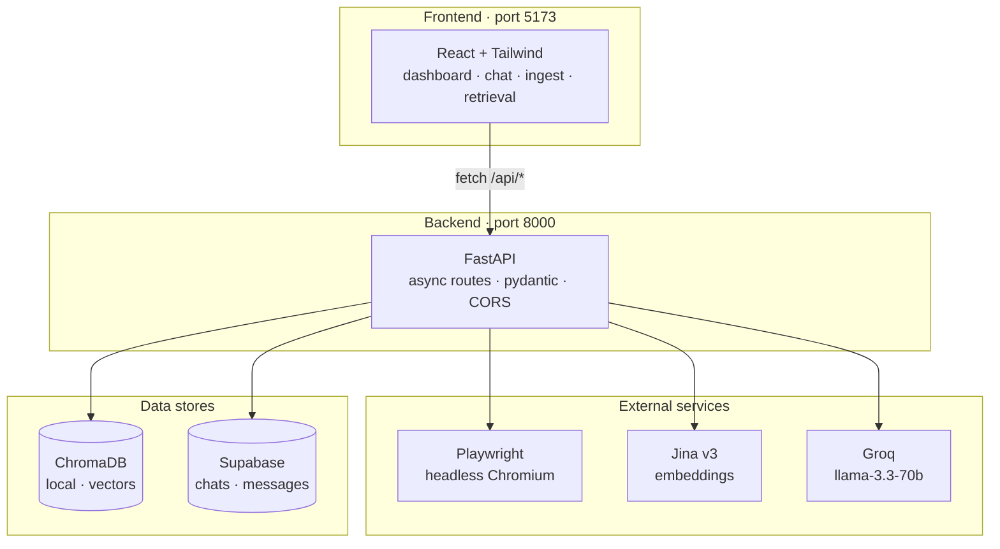
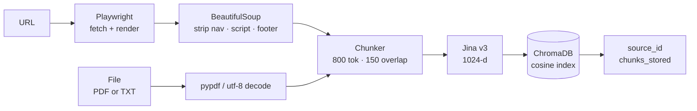
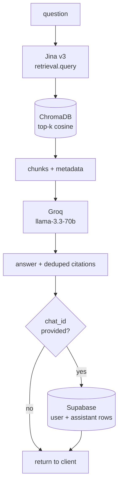
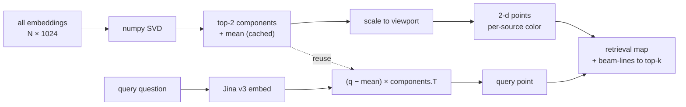

# Scrybe

It writes down what it reads, then answers what you ask.

A self-building knowledge base — feed it URLs and files, ask anything, get grounded answers with citations.

Full-stack: web automation, RAG pipeline, vector search, LLM orchestration, persisted chat.

---

## What it does

You point it at URLs or upload PDFs/TXT. It scrapes, chunks, embeds, and stores everything in a vector store. Then you ask questions through a chat UI and get answers grounded in your sources, with citations you can click through. Every chat is saved to Supabase so you can pick up old threads.

---

## Architecture



---

## Ingest workflow



## Query workflow



## Retrieval map

Every chunk in ChromaDB is projected from 1024-d Jina space to 2-d via numpy PCA, colored per source. Running a query embeds the question, projects it through the same PCA matrix, and overlays it with beam-lines to the top-k hits.



---

## Tech stack

| Layer        | Choice                  | Why                                  |
|--------------|-------------------------|--------------------------------------|
| Backend      | FastAPI                 | async, pydantic-validated            |
| Scraping     | Playwright              | async-native, handles JS SPAs        |
| Parsing      | BeautifulSoup4 + pypdf  | proven                               |
| Embeddings   | jina-embeddings-v3      | 1024-d, SOTA multilingual            |
| Vector store | ChromaDB                | persistent, metadata filters         |
| LLM          | Groq · llama-3.3-70b    | sub-second inference                 |
| Persistence  | Supabase (Postgres)     | chats + messages, free tier          |
| Frontend     | React 18 + Tailwind     | in-browser Babel, no build step      |

---

## Setup

Two services. Run them in separate terminals.

### 1. Backend

```bash
cd backend
pip install -r requirements.txt
playwright install chromium
cp .env.example .env        # then fill in keys
uvicorn app.main:app --reload --port 8000
```

Required keys in `backend/.env`:

| Variable                       | Where to get                    | Required |
|--------------------------------|---------------------------------|----------|
| `GROQ_API_KEY`                 | console.groq.com                | yes      |
| `JINA_API_KEY`                 | jina.ai                         | yes      |
| `SUPABASE_URL`                 | supabase.com → project settings | optional |
| `SUPABASE_SERVICE_ROLE_KEY`    | supabase.com → API settings     | optional |

If you set the Supabase vars, paste `backend/supabase_schema.sql` into the Supabase SQL editor once. Without them, chats stay in browser memory only.

### 2. Frontend

```bash
cd frontend
python -m http.server 5173
```

Open `http://localhost:5173`.

---

## API reference

| Endpoint                    | Method                | Purpose                                              |
|-----------------------------|-----------------------|------------------------------------------------------|
| `/health`                   | GET                   | liveness                                             |
| `/api/ingest/url`           | POST                  | scrape + index a URL                                 |
| `/api/ingest/file`          | POST                  | upload + index a PDF or TXT                          |
| `/api/sources`              | GET                   | list indexed sources                                 |
| `/api/sources/{id}`         | DELETE                | remove a source (cascade-deletes its chunks)         |
| `/api/query`                | POST                  | retrieve + answer; optional `chat_id` to persist     |
| `/api/chats/status`         | GET                   | whether Supabase is configured                       |
| `/api/chats`                | GET, POST             | list / create chat                                   |
| `/api/chats/{id}`           | GET, PATCH, DELETE    | thread crud                                          |
| `/api/vector_map`           | GET                   | PCA-projected chunks for the retrieval map           |
| `/api/vector_map/query`     | POST                  | project a query + return top-k for the overlay       |

---

## Project layout

```
scrybe/
├── backend/
│   ├── app/
│   │   ├── api/
│   │   │   ├── routes/        ingest · query · sources · chats · vector_map
│   │   │   └── schemas.py
│   │   ├── services/          scraper · chunker · embedder · store ·
│   │   │                      retriever · llm · chats · vector_map
│   │   ├── core/config.py
│   │   └── main.py
│   ├── supabase_schema.sql
│   ├── requirements.txt
│   └── .env.example
└── frontend/
    ├── index.html
    ├── api.js                 fetch wrapper
    ├── app.jsx                shell · sidebar · topbar · command palette
    ├── components.jsx         shared primitives
    └── screens/               dashboard · ingest · chat · retrieval · settings
```

---

## Notes

- Prototype scope. No auth, no rate limiting, single workspace.
- Frontend has no build step — Babel compiles JSX in the browser. Hard-refresh after edits.
- ChromaDB persists to `backend/chroma_db/` (gitignored).
- Supabase persistence is optional and degrades gracefully when unconfigured.
- All secrets live in `backend/.env`; never committed.
